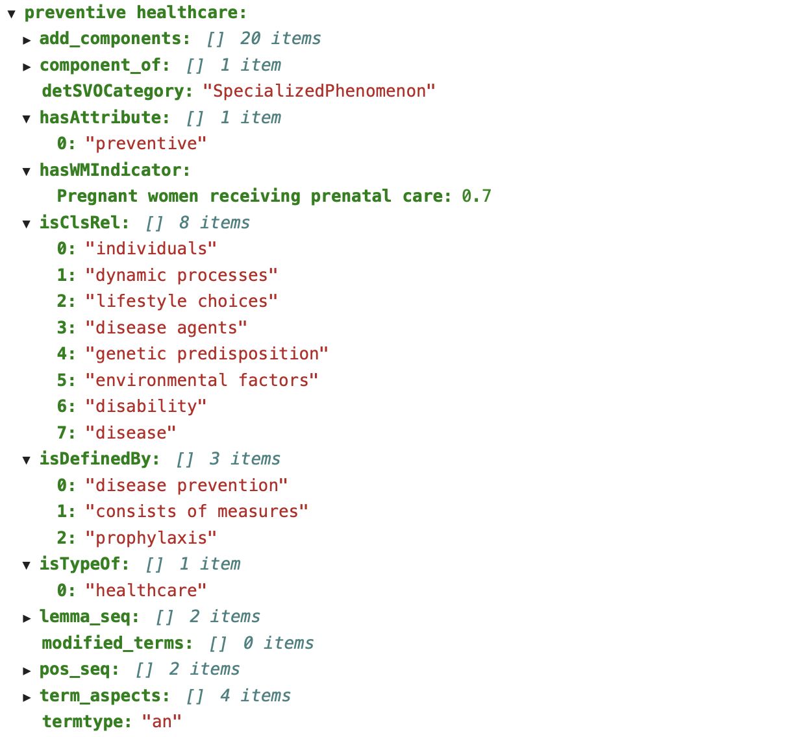
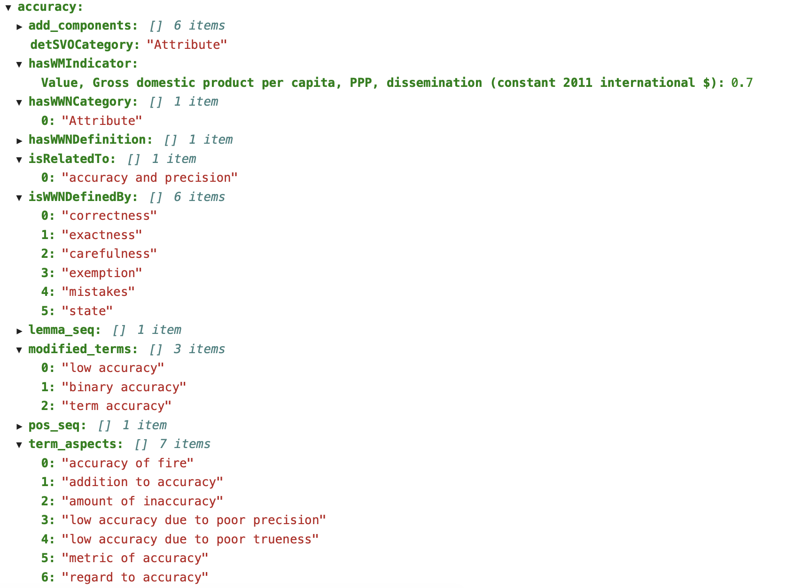
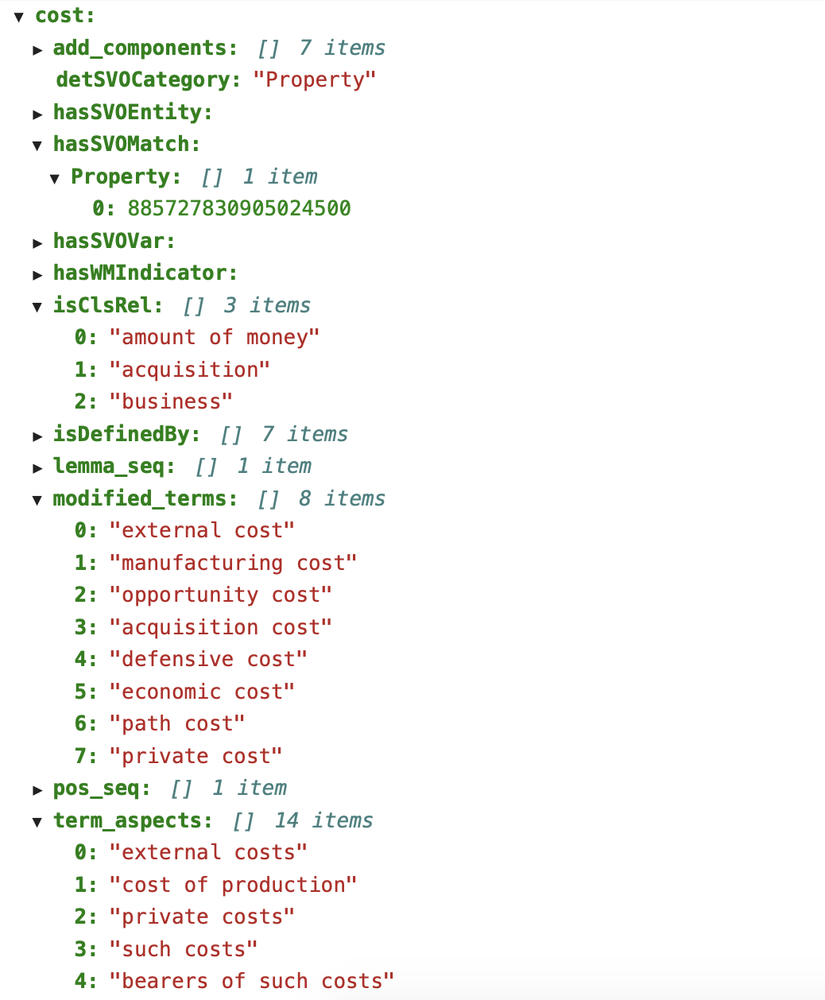

This repository contains modules for enabling Scientific Variable exploration and grounding to SVO and WM variables.

## Usage

### Pretty document generation.
For pretty printed output, use user_interaction module document generator:

``import user_interaction as ui``

``graph = ui.generate_document(levels = 1, load_graph = None, write_graph = False)``

 - levels determines the depth to which the graph is expanded
    - the value '1' should be used for quick, rough runs
    - the value '2' should be used for higher accuracy
    - values higher than 3 are not allowed
    
 - load_graph - takes in a filename to load an existing graph into memory
 - write_graph - write resulting graph to file

### Programmatic interaction.
For programmatic interaction, use knowledge_graph module:

``import knowledge_graph as kg``

``graph = create_graph(var = '', levels = 1, graph = None, write_graph = False)``

 - var is the variable text
 - levels determines the depth to which the graph is expanded
 - graph - takes in a filename to load an existing graph into memory
 - write_graph - write resulting graph to file
 
Please consult the iPython notebook for examples.

## Output Graph

Output graph is in the form of a Python dictionary with keys being nodes and values representing edge-node relationships.

### Examples
Here are some examples of the information available in an outputted graph:

Node: Preventive healthcare

Node: accuracy

Node: cost

### Description of output graph attributes.

Nodes contain either single nouns, single adjectives, noun groups (compound nouns), modified noun/noun groups (modified with an adjectival attribute), or single noun-compound noun-modified noun/noun groups linked together with adpositions.

Edge values for the different types of nodes are:

- nodes containing nouns, noun groups, or modified noun groups separated by adpositions
    - components: list of nodes which are terminology components of the src node
          - complement: component_of
- nodes containing a noun or a noun group modified by an attribute (an adjective)
    - isTypeOf: noun or noun group component of a modified noun or noun group (list)
        * complement: hasType
    - hasAttribute: adjectival attribute(s) of noun or noun group (list)
        * complement: isAttributeOf
- nodes containing a noun group:
    - hasComponentNounConcept
        * complement: isComponentNounConceptOf
   
Additionally, any node may have the following associated edges:

- World Modelers Indicators related:
     - hasWMIndicator: dictionary of indicators with a ranked match value (0-1) of how closely it is related to the term
 
- Scientific Variables Ontology related:
     - detSVOCategory: automatically determined top-level SVO category
     - hasSVOMatch: matched SVO entity
     - hasSVOVar: dictionary of SVO variables with a ranked match value (0-1) of how closely it is related to the term
     - hasSVOEntity: dictionary of SVO entities other than variables with a ranked match value (0-1) of how closely it is related to the node term
     _**Please note that SVO entities are hashed to prevent large file size. The hash mapping can be found in the resources folder.**_
 
- Wikipedia related:
     - hasSynonym: synonym as determined from Wikipedia search
     - isDefinedBy: terms found in the Wikipedia definition of the node term
     - isRelatedTo: closely related term found in Wikipedia
     - isClsRel: terms found in the Wikipedia definition paragraph of the node term
 
- WiktiWordNet related:
     - hasWWNDefinition: a list of definitions from WWN
     - hasWWNCategory: a top-level, domain indenpendent WWN category aligned with SVO top-level classes
     - isWWNDefinedBy: WWN terms used to define this node that may be of interest
 

